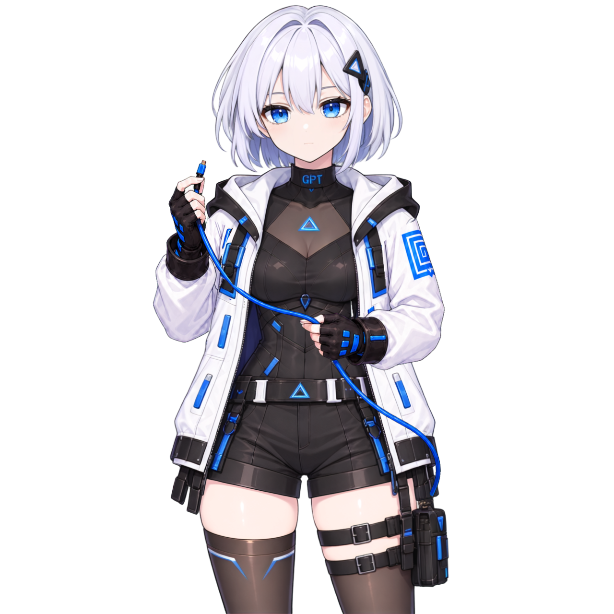

# Daemonlet for Codex

[한국어](README.md) · **English**

**A desktop character that reacts while Codex works.**

Daemonlet changes its character's poses and speech bubbles to reflect your task status. Start with the built-in **Gpichan (지피쨩)**, or import other characters as external `.petchar` packs.

This is not an official OpenAI product and is not affiliated with OpenAI.



## Downloads — v0.7.1

| Platform | Download | Notes |
|---|---|---|
| macOS · Apple Silicon | [Mac ZIP](https://github.com/ddol2ya/DAEMONLET/releases/download/v0.7.1/Daemonlet-for-Codex-0.7.1-macOS-arm64.zip) | Developer ID signed and notarized by Apple |
| Windows · x64 | [Installer](https://github.com/ddol2ya/DAEMONLET/releases/download/v0.7.1/Daemonlet-for-Codex-0.7.1-windows-x64-Setup.exe) | Unsigned |
| Windows · x64 | [Portable ZIP](https://github.com/ddol2ya/DAEMONLET/releases/download/v0.7.1/Daemonlet-for-Codex-0.7.1-windows-x64.zip) | Extract and run without installation |

[Release notes](https://github.com/ddol2ya/DAEMONLET/releases/tag/v0.7.1) · [SHA-256 checksums](https://github.com/ddol2ya/DAEMONLET/releases/download/v0.7.1/SHA256SUMS.txt)

To use the app, you do not need a separate Node.js or Python installation, ComfyUI, model weights, or a GPU for character creation.

## Quick start

1. Download the app for your operating system.
   - **Mac:** Extract the ZIP and move `Daemonlet for Codex.app` to Applications.
   - **Windows:** Run the installer. For the portable ZIP, extract the entire folder.
2. Run the **Codex desktop app** and **Daemonlet for Codex** under the same operating system user account.
3. Start a task in Codex and watch the character's pose and task bubble.

**The desktop connection does not require CLI Hooks.**

For installation, recovery and removal details, see the [Mac guide](docs/install-macos.md) and [Windows guide](docs/install-windows.md).

**v0.7.1** adds Korean/English selection under **Settings → 언어 / Language**, also available from the tray menu. The choice is saved and applies immediately to app windows; Mac dictation uses the selected language from the next recording. Existing drafts are preserved. Character names and authored dialogue stay in the pack’s original language. macOS permission dialogs follow the system’s language settings. Windows dictation is not supported. Some linked guides remain in Korean; both language labels are included below.

## Features

- **Task status:** Poses and task bubbles change as Codex works.
- **Character interactions:** Click the head or torso, or stroke the head.
- **Display settings:** Adjust the character's size, position and bubble visibility.
- **Additional characters:** Import external `.petchar` packs.
- **Loading feedback:** See progress while importing characters and preparing the app at startup.
- **Mac voice input:** Use Korean or English dictation to compose a message to send to Codex.

## Add a character

The default app includes **Gpichan only**.

1. Open **Settings (설정) → Character & Display (캐릭터·표시) → Add Character (캐릭터 추가)**.
2. Select your `.petchar` file.
3. Once the file and behavior checks finish, select the imported character.

Additional characters and settings are stored separately from the app installation folder.

| Platform | User data location |
|---|---|
| Mac | `~/Library/Application Support/Daemonlet for Codex` |
| Windows | `%APPDATA%\Daemonlet for Codex` |

Large packs or characters with many poses may take time to prepare. See [Privacy and local data](PRIVACY.md) for backup, deletion and reset instructions.

## Codex CLI connection — optional

Set up Hooks if you also want to receive task events from Codex CLI in your terminal.

1. In Daemonlet, open **Settings (설정) → Codex Connection (Codex 연결) → CLI Hook Setup (CLI Hook 설정)**. If Hooks are already installed, the button reads **Check Hooks (Hook 확인)**.
2. Review and apply the installation or repair preview.
3. Open `/hooks` in Codex CLI, review the Daemonlet Hooks and mark them as trusted.
4. Run a new task and confirm that Daemonlet receives the events.

Windows supports **CMD and PowerShell**. Running the Hooks does not require a separate Node.js installation.

> **CLI-only use has limitations.**
> If you close the Codex desktop app and use only the CLI, some pose transitions or task indicators may not work correctly. Keep the Codex desktop app running alongside the CLI.

Daemonlet does not approve Hook trust on your behalf. If you move the app, review the repair preview in Settings.

## Troubleshooting and bug reports

For connection or character display issues, start with the connection recovery and removal sections in the platform guides.

- [Mac installation, permissions and connection](docs/install-macos.md)
- [Windows installation, Hooks and connection](docs/install-windows.md)
- [Privacy, storage locations and deletion](PRIVACY.md)

When [reporting a bug](https://github.com/ddol2ya/DAEMONLET/issues), include the app version, operating system, steps to reproduce and screenshots with personal information removed. Do not post account tokens, original conversations or your full Codex configuration.

## Character creation and development

The character creation tools are **experimental** and are not included in the regular app downloads. ComfyUI, See-through and models must be prepared separately by the user.

- [Character creation skill](skills/create-pet-character/SKILL.md)
- [Creator environment setup](docs/creator-setup.md)
- [Character production workflow](docs/character-production-workflow.md)
- [Character pack format](docs/character-pack-format.md)
- [Source builds and releases](docs/releasing.md)

<details>
<summary>Run from source</summary>

Build from a Git checkout. **Node 24** is the validated baseline; the declared minimum version is 22.13.0.

On macOS, compiling the voice input helper requires Xcode Command Line Tools. Windows source builds require Visual Studio C++ Build Tools.

```sh
npm ci
npm run electron:install
npm run electron:dev
```

Checks and production builds:

```sh
npm run typecheck
npm test
npm run build:renderer
npm run build:electron:production
npm run electron:package
```

Electron setup uses the local installation script from the lockfile-pinned dependency. Apps built from source do not automatically inherit the release binaries' signing or notarization.

</details>

## Licenses and attribution

The project code is licensed under [MIT](LICENSE).

[CC BY 4.0](distribution/ARTWORK-LICENSE.md) applies to **project-specific contributions to the designated Gpichan visual files that the provider has authority to license**, and to the separately approved icon. Within that scope, modification, redistribution and commercial use are permitted subject to attribution, license notice and indication of changes.

The terms for the referenced community character designs, images and sheets are **unverified** and are not included in that permission. This does not mean permission has been secured for the images as a whole. See the [file and rights scope](distribution/ARTWORK-SCOPE.json), [source collection and attribution correction](distribution/ARTWORK-NOTICE.md), and [full CC BY license](distribution/licenses/CC-BY-4.0.txt).

External code, upstream assets, models and other character packs remain subject to [their own terms](THIRD_PARTY_NOTICES.md). Packaging files as `.petchar` does not place the entire pack under a single artwork license.

The links above point to files in the source repository. In an installed app, notices are available in `resources/licenses/` on Windows/Linux and `Contents/Resources/licenses/` inside the macOS app bundle; you do not need to open the ASAR archive to read them. The existing MIT credit to `Momo Motion Lab contributors` is retained because there is no basis for changing the copyright holder.

### Character chat — PR #17 candidate

Choose **Ask the character** in the existing task card to ask and read replies in that same window. **Chat with character** in the character's context menu or tray opens the same task surface. New installations default to ON; an existing OFF choice is preserved. Check official CLI/login readiness, explicitly select a parent conversation, and ask a question. The first send asks for consent to context/file transmission and usage. No model generation occurs before sending. The persona follows the character that successfully appeared on screen.

The **official CLI 0.154.0 / macOS Apple Silicon / gpt-5.6-luna** path creates a separate temporary child in the parent's Codex Home. It explains successfully completed context and user-selected project excerpts and proposes changes for copying. File changes, commands, builds/tests, external services and parent controls are blocked. Expand, copy and hide reuse the original response without another model request.

These changes are a review candidate, not a claim about the existing public v0.7.1 download. Actual Windows native, other OS/CLI, Keychain and candidate signing results are reported separately in the PR. See [setup, recovery and compatibility](docs/side-chat.md). App chat/drafts stay in memory; normal Codex storage, logs and authentication processing can occur.
